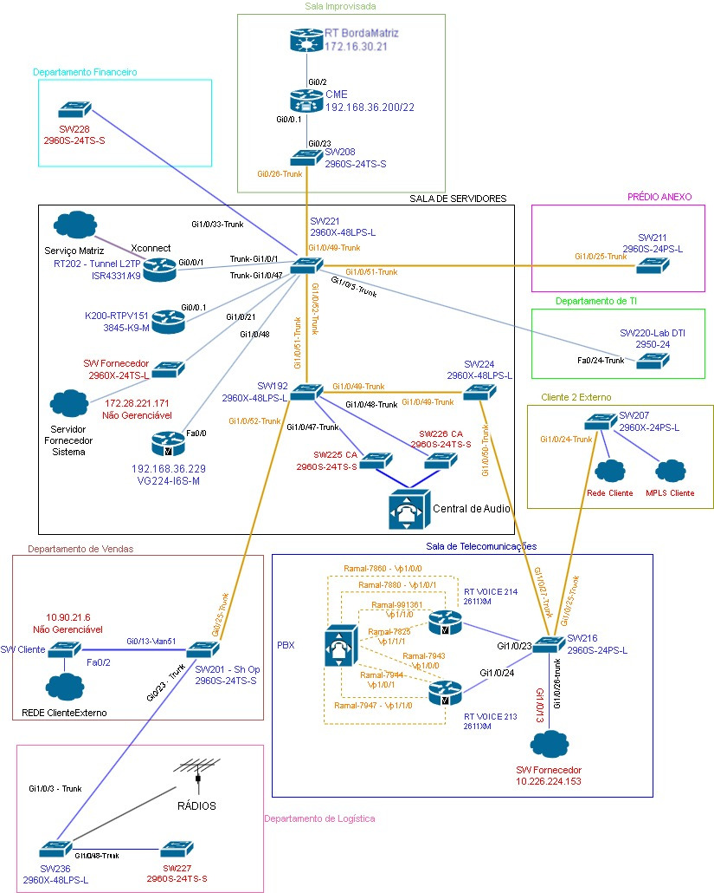
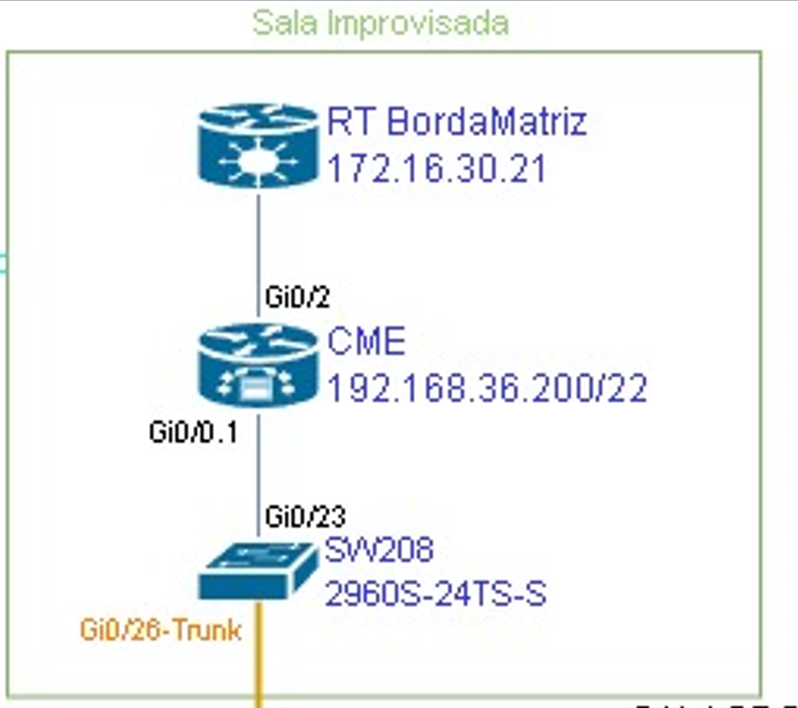
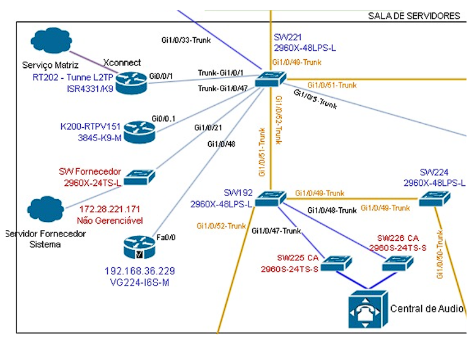
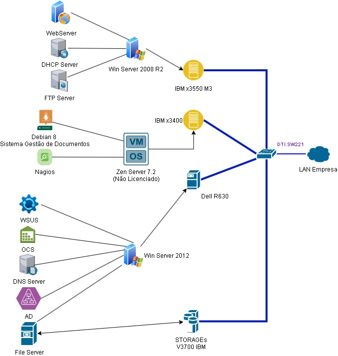
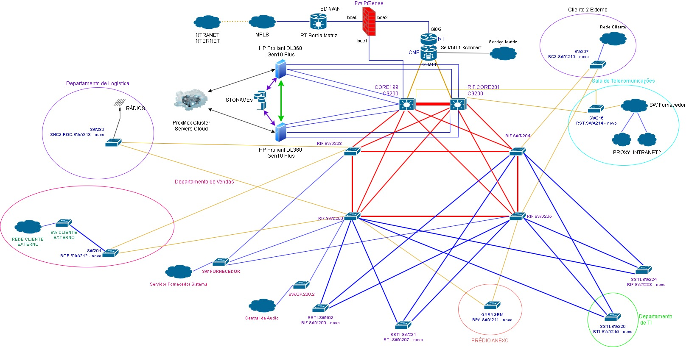
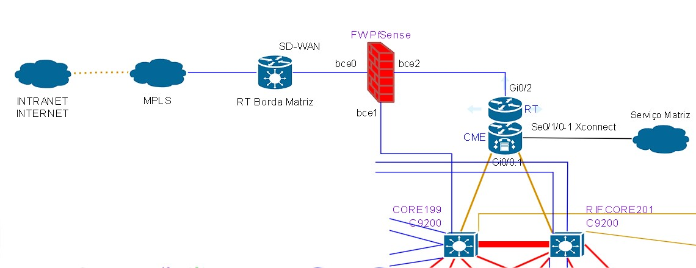
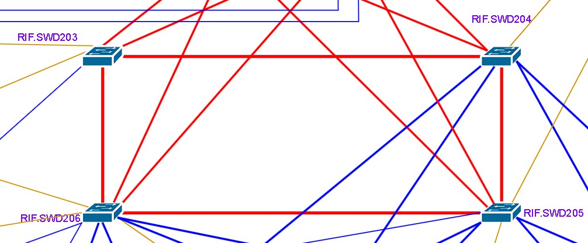
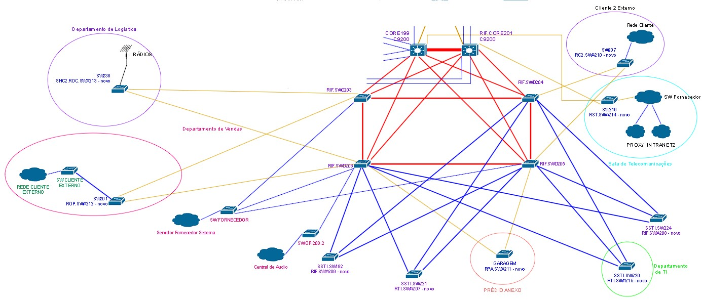

# Projeto 1: Migração e Melhorias de TI

## 1. Introdução e Objetivo

Este projeto tem como objetivo realizar a migração e a melhoria completa da infraestrutura de TI para o GitHub, utilizando a transição como uma oportunidade para implementar uma série de melhorias essenciais. O projeto deve ser executado dentro dos prazos estabelecidos, utilizando a equipe atual, sem possibilidade de expansão. O resultado esperado é uma migração organizada, garantindo que todos os equipamentos e serviços estejam 100% operacionais.

## 2. Avaliação da Infraestrutura Atual

### Topologia de Rede Inicial

- **Imagem da Topologia Física de Rede Atual:** A imagem ilustrará a topologia física de redes atual, destacando a configuração existente e os pontos críticos identificados antes da migração.

### Problemas Identificados

- **Ausência de Redundância:** A falta de redundância representa um risco significativo à continuidade dos serviços.
- **Medidas de Segurança Insuficientes:** A segurança da informação está comprometida pela falta de medidas adequadas.
- **Redistribuição Necessária:** A reorganização de endereçamento IP e VLANs é essencial para a nova estrutura.

### Problemas Específicos - Camada CORE

- A camada CORE da rede estava mal localizada, necessitando de uma mudança para a Sala de Servidores. Este problema já foi resolvido, permitindo o progresso das melhorias planejadas.

**Imagem da Camada CORE:** 

### Problemas Específicos - Camada de DISTRIBUIÇÃO

- **Mistura de Funções entre Camadas de Distribuição e Acesso:** Não há uma distinção clara entre as camadas de Distribuição e Acesso, resultando em uma sobreposição de funções entre os switches. Além disso, a falta de redundância significa que todos os dispositivos dependem de um único switch (SW 221) para acessar redes externas. Para resolver essa situação, a topologia física e lógica será reorganizada.

- **Ausência de Spanning-Tree Adequado:** Não há implementação de um protocolo Spanning-Tree apropriado, o que aumenta o risco de loops na rede e impede a orientação eficiente do tráfego na camada 2.
- **Falta de Segregação de VLANs:** Não existe segregação de VLANs para sub-redes de gerenciamento e servidores, criando uma vulnerabilidade na segurança da rede.
- **Medidas de Segurança Insuficientes para Vlan Attacks e Outros:** Não há proteção contra ataques específicos, como Vlan Attacks, DHCP Snooping e ARP Attacks, o que deixa a rede exposta a diversas ameaças.
- **Monitoramento Ineficaz:** O monitoramento dos ativos e do tráfego nos principais pontos da rede é ineficiente. Muitos links não funcionam adequadamente, e o sistema de monitoramento atual não é capaz de fornecer atualizações em tempo real.
- **Documentação Inadequada:** A documentação da infraestrutura de rede é insuficiente, dificultando o controle e a rastreabilidade de problemas ou alterações.
- **Falta de Segurança no Controle de Tráfego:** Não há um firewall dedicado para controlar o fluxo de tráfego que entra e sai da rede. A única medida de segurança existente são algumas regras implementadas diretamente no roteador de borda da empresa.

### Problemas Específicos - Topologia de Servidores

- **Falta de Segmentação Adequada:** A topologia atual dos servidores não possui segmentação clara entre diferentes funções (servidores de aplicação, banco de dados, web e gerenciamento). Essa configuração compromete a segurança e a eficiência da rede.
- **Ausência de Balanceamento de Carga:** Não há um balanceamento de carga efetivo para os serviços críticos, resultando em pontos únicos de falha.
- **Distribuição de Serviços Não Otimizada:** A distribuição atual dos serviços contribui para alta latência e maior tempo de resposta.
- **Monitoramento de Servidores Inadequado:** Monitoramento limitado, sem ferramentas proativas para avaliar a saúde e o desempenho dos sistemas.
- **Deficiências na Redundância de Hardware e Software:** Falta de redundância adequada para garantir a continuidade dos serviços em caso de falhas.
- **Falta de Atualização e Patching:** Diversos servidores operam com sistemas desatualizados, sem patching regular.
- **Capacidade de Backup e Recuperação Limitada:** Políticas e práticas de backup insuficientes para garantir recuperação rápida e completa.

### Imagem da Topologia Física de Servidores Atual

- Uma imagem será inserida para ilustrar a topologia atual dos servidores, destacando a estrutura de conexão e o layout de distribuição dos principais serviços e recursos.

## 3. Design e Projeto da Nova Topologia Física

Realizada a análise dos requisitos e o estudo de viabilização de uma nova topologia, foi concebida uma nova estrutura após muitas alterações e melhorias. Nesta topologia, há várias redundâncias que permitem a continuidade dos serviços ofertados. No entanto, para que seja viável, é fundamental a implementação de diversas tecnologias novas nos ativos de redes e servidores. Em seguida, trataremos dos pormenores da implementação e migração desta topologia em cada aspecto.

**Legenda para a nova topologia:**
- **Laranja:** Fibra Óptica  
- **Azul:** Cabo UTP  
- **Azul Forte:** Etherchannel no UTP  
- **Vermelho Forte:** Etherchannel no UTP ou na Fibra (dependendo da disponibilidade de portas)  
- **Preto com Duas Setas:** Virtualização  
- **Verde com Duas Setas:** Conexões especiais diretas  
- **Roxo com Duas Setas:** Rede SAN  
- **Azul com Conexão Serial:** Túnel L2TP Xconnect  

Além desta topologia física da infraestrutura, é de suma importância detalharmos a **Server Cloud** representada na imagem anterior, que é realizada pelo Cluster gerenciado pelo Proxmox.

**Imagem da Nova Topologia de Servidores:**

### 3.1 Camada CORE da Topologia

A topologia da camada CORE é essencial, pois é responsável pela entrada para a rede interna (LANs) e pela saída para as redes externas (Intranet e Internet). É nesta camada que ocorre todo o roteamento, seja entre as VLANs, seja para redes externas.

Além disso, a camada CORE desempenha um papel crucial na segurança da informação. Através do Firewall, são aplicados filtros, e as Access Lists direcionam o tráfego apenas para os destinos necessários.

**Imagem da Camada CORE:**

### 3.2 Camada de DISTRIBUIÇÃO da Topologia

Nesta camada da topologia física, serão estabelecidos links redundantes entre todos os switches de distribuição e entre os switches CORE, utilizando a tecnologia **Etherchannel**. Essa tecnologia permite redundância de link e agregação de link, aumentando a banda de transferência para 2 Gbps entre os switches.

Além disso, será necessário implementar o **Spanning-Tree**, uma tecnologia utilizada para evitar loops nos links redundantes e para estabelecer o caminho mais curto para o destino em layer 2. Foi realizada uma análise minuciosa de cada VLAN para definir as topologias lógicas e os caminhos prioritários.

Serão também implementadas tecnologias de segurança da informação, como **Port-Security** para controle dos dispositivos conectados, além de medidas contra **DHCP Snooping**, **Dynamic ARP Inspection**, e outras.

**Imagem da Camada de DISTRIBUIÇÃO:**

### 3.3 Camada de ACESSO da Topologia

A camada de acesso é a camada onde são conectados os dispositivos finais. Nossa rede possui diversos tipos de dispositivos finais, incluindo:

- Computadores
- Notebooks
- Impressoras
- Telefones IP Cisco
- Centrais de Áudio
- Central de Gravação de Áudio
- Rádios 
- Outros dispositivos

**Imagem da Camada de ACESSO:**

Grande parte dos switches de acesso são conectados a pelo menos dois outros switches da camada de distribuição. Dessa forma, caso algum switch de distribuição ou link entre eles se rompa, outro link poderá assumir a função. Para isso, é essencial que o **Spanning-Tree** e o **Etherchannel** estejam corretamente configurados entre esses switches.

A conexão entre os switches de acesso e os dispositivos finais é configurada especificamente nas VLANs necessárias, e o **Port-Security** será implementado para controle dos dispositivos conectados em toda a infraestrutura.

Para que esta topologia física seja implementada, diversas análises e novas tecnologias deverão ser introduzidas. Estas serão citadas, explicadas e implementadas a seguir.

PAREI AQUI

## 4. Status Atual das Implementações

### Redes

- **Mudança MPLS:** OK
- **Nova Topologia Física:** 95%
- **Endereçamento:** OK
- **VLAN Nativa:** OK
- **VLANs:** OK
- **Trunks:** 95%
- **Inter-VLAN Routing:** OK
- **STP:** 98%
- **Etherchannel:** 95%
- **ACLs:** 10%

### Servidores/Storage

- **Proxmox:** 70% (Cluster pendente)
- **Netbox:** 90%
- **Zabbix:** 90%
- **Prometheus:** 100%
- **InfluxDB:** 100%
- **Grafana:** 70%
- **Bacula:** 0%
- **Web:** 90% (Revisão necessária)
- **DNS/DHCP:** 100% (Revisar produção no AD)
- **Active Directory:** 80% (Migração para novo servidor pendente)
- **WSUS:** 100%
- **AD (SAMBA):** 0%
- **Syslog:** 0%
- **TACACSGU:** 30%

### Segurança

- **pfSense:** 100%
- **Layer 2 Security:**
  - **DHCP Snooping:** 50%
  - **Dynamic ARP Inspection:** 50%
  - **Port Security:** 0%
  - **VLAN Attacks Mitigation:** 50%
- **FW ASA5550:** 0%

## 5. Próximos Passos

- **Ações Faltantes:** Concluir as pendências relacionadas às ACLs, Bacula, migração do Active Directory, entre outros.
- **Testes e Validação:** Realizar testes de segurança na camada 2 e validar o script de segurança de VLANs.
- **Documentação e Publicação:** Finalizar a documentação técnica do projeto e preparar sua publicação no GitHub e LinkedIn.

## Contribuições

Para contribuir com o projeto, abra uma issue ou envie um pull request.

---
