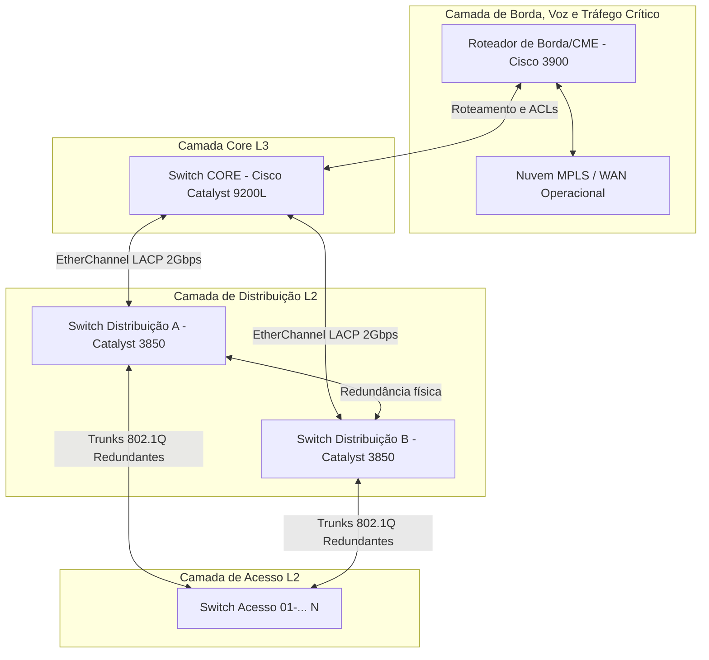

# 🌐 Arquitetura e Engenharia de Conectividade (Cisco IOS)

Este diretório contém a documentação da arquitetura e das soluções técnicas de conectividade implementadas nos ativos de rede (roteadores e switches Cisco) da infraestrutura. 

Com o objetivo de viabilizar a hospedagem pública e segura deste portfólio no GitHub, todos os dados sensíveis foram mascarados utilizando metodologias de **preservação lógica de topologia**.

---

## 🏗️ Visão Geral da Arquitetura de Rede

A infraestrutura lógica e física de rede foi projetada utilizando o modelo de três camadas da Cisco (Core, Distribuição e Acesso), integrado a uma borda WAN capaz de gerenciar serviços de telefonia IP (CME), tráfego de controle aéreo/telemetria e trânsito seguro de dados.

# Updated Mermaid diagram with specific hostnames


---

## <a id="plano-vlans"></a>🏷️ Plano Lógico de Segmentação (VLANs e Sub-redes)

[⬅️ Voltar para Plano Lógico no README Principal](../README.md#41a-endereçamento-ip)

A rede está dividida logicamente nas seguintes VLANs, estruturadas sob um esquema VLSM rigoroso para otimização do espaço de endereçamento IP corporativo:

| ID VLAN | Nome da VLAN | Tipo de Tráfego / Descrição | Gateway Padrão (Exemplo Genérico) |
| :---: | :--- | :--- | :--- |
| **53** | `SIST.FORNECEDOR` | Rede isolada para tráfego e acesso de sistemas de terceiros/fornecedores. | `192.168.53.254/24` |
| **100** | `SERVERS` | Servidores corporativos críticos (Active Directory, DNS, Netbox, Virtualização). | `192.168.100.254/26` |
| **104** | `CLIENTE2` | Segmentação dedicada para conexões de clientes externos específicos. | `192.168.104.254/24` |
| **200** | `GERENCIAMENTO` | Rede de gerenciamento em banda (In-band Management) para switches/roteadores (SSH). | `192.168.200.254/25` |
| **300** | `VOICE` | Rede de tráfego de voz (VoIP) priorizada por QoS. | `192.168.300.254/25` |
| **400** | `INTRANET` | Rede de estações de trabalho locais (computadores e notebooks de usuários). | `192.168.10.254/24` |
| **510** | `CENTRAL.DE.AUDIO`| Rede dedicada para integração com matrizes e centrais de gravação de áudio. | `10.51.0.254/24` |
| **511** | `CA_A` | Canal A de tráfego operacional de áudio. | `10.51.1.254/24` |
| **512** | `CA_B` | Canal B de tráfego operacional de áudio (redundância física). | `10.51.2.254/24` |
| **513** | `CA_TRANSITO` | VLAN de trânsito para áudio operacional entre localidades. | `10.51.3.254/30` |
| **514** | `WAN_KIT.200` | Link de trânsito dedicado para a WAN de áudio operacional. | `10.51.4.254/30` |
| **666** | `BlackHole` | VLAN de descarte para isolamento de portas físicas não utilizadas nos switches. | N/A (Sem Roteamento) |

---

## 🛠️ Tecnologias de Conectividade Implementadas

As seções a seguir detalham o funcionamento, as justificativas de design e os modelos genéricos de configuração para cada uma das camadas de rede implementadas.

---

## <a id="camada-1"></a>🔵 Camada 1: Conectividade Física e Interfaces Lógicas (Layer 1)

[⬅️ Voltar para Seção de Design no README Principal](../README.md#3-design-e-projeto-da-nova-topologia-física)

A Camada 1 gerencia as características elétricas, mecânicas e funcionais dos links de transmissão físicos, além da definição de interfaces lógicas base do Cisco IOS.

### <a id="l1-serial"></a>1. Conexões Seriais Síncronas WAN
* **O que é:** Configuração de interfaces seriais físicas (`Serial0/x/x`) operando em modo síncrono com ajustes manuais de taxa de relógio (`clock rate`).
* **Por quê:** Vital para receber telemetria de sensores de tráfego de baixa velocidade e sinais de Radar (Terminal e Rota) que utilizam circuitos seriais legados antes de serem encapsulados sobre IP.
* **Modelo Genérico de Configuração:**
  ```ios
  interface Serial0/1/0
   description CONEXAO_SERIAL_RADAR_SINC
   no ip address
   encapsulation frame-relay   ! (ou HDLC/PPP de acordo com o link de entrega)
   clock rate 19200            ! Taxa de sincronismo do circuito serial síncrono
   no cdp enable
  ```

### <a id="l1-e1"></a>2. Controladores Digitais E1 (CAS R2)
* **O que é:** Configuração de placas controladoras E1 (`controller E1`) para dividir links de alta densidade em 30 canais digitais de voz usando o protocolo CAS R2 Digital.
* **Por quê:** Permite conectar a central telefônica local (PABX) do esquadrão com operadoras públicas ou redes privadas de trânsito de telefonia (ex: Rede de Voz da Aeronáutica), otimizando a largura de banda física.
* **Modelo Genérico de Configuração:**
  ```ios
  controller E1 0/3/0
   ds0-group 0 timeslots 1-15,17-31 type r2-digital r2-compelled ani
   cas-custom 0
    country brazil use-defaults ! Sinalização padrão CAS R2 utilizada no Brasil
  ```

### <a id="l1-loopback"></a>3. Interfaces Virtuais Loopback
* **O que é:** Interfaces puramente lógicas criadas dentro do software do roteador (`interface Loopback`).
* **Por quê:** Elas nunca saem do estado "up/up" (a menos que sejam manualmente desativadas). São utilizadas como:
  * ID estável e permanente para o processo de roteamento dinâmico OSPF.
  * Endpoint estável para túneis GRE/IPsec (evita queda do túnel caso uma interface física oscile).
  * Ponto de origem estável para envio de dados Netflow e SNMP traps de gerência.
* **Modelo Genérico de Configuração:**
  ```ios
  interface Loopback0
   description ID_LOGICO_DISPOSITIVO
   ip address 192.168.255.1 255.255.255.255
  ```

---

## <a id="camada-2"></a>🟢 Camada 2: Engenharia de Enlace e Segurança de Borda (Layer 2)

[⬅️ Voltar para Seção de Distribuição no README Principal](../README.md#32-camada-de-distribuição-da-topologia)

A Camada 2 gerencia como os pacotes de dados são transportados sobre meios físicos e implementa redundância de links locais e proteção contra loops em nível de frame.

### <a id="l2-stp"></a>1. Rapid Spanning Tree Protocol (Rapid-PVST+)
* **O que é:** Evolução do Spanning Tree tradicional que previne loops físicos em topologias com redundância, convergindo a rede em menos de 2 segundos após falhas de cabo ou switch.
* **Por quê:** Permite criar caminhos físicos redundantes e redundância de uplinks sem o risco de tempestades de broadcast (*broadcast storms*). A prioridade do switch CORE é configurada manualmente mais baixa para garantir que ele seja a raiz (`root`) lógico de todas as árvores lógicas da topologia.
* **Modelo Genérico de Configuração:**
  ```ios
  ! Habilitar o modo Spanning Tree rápido
  spanning-tree mode rapid-pvst
  spanning-tree extend system-id
  
  ! No Switch CORE (Define o CORE como Root Primary)
  spanning-tree vlan 53,100,200,300,400 priority 4096
  
  ! No Switch de DISTRIBUIÇÃO (Define o Distribuição como Root Secondary)
  spanning-tree vlan 53,100,200,300,400 priority 8192
  ```

### <a id="l2-portfast"></a>2. Spanning-Tree PortFast e BPDU Guard (Segurança de Borda L2)
* **O que é:**
  * **PortFast:** Faz com que portas conectadas diretamente a dispositivos finais (como PCs e telefones) passem do estado de bloqueio para o estado de encaminhamento instantaneamente, ignorando os estados de escuta e aprendizagem do STP.
  * **BPDU Guard:** Desativa a porta automaticamente (estado *err-disable*) caso um switch secundário ou dispositivo malicioso envie pacotes BPDU na porta de acesso, impedindo que switches não autorizados afetem a topologia.
* **Modelo Genérico de Configuração (Portas de Acesso):**
  ```ios
  interface GigabitEthernet1/0/5
   description PORTA_USUARIO_FINAL
   switchport mode access
   switchport access vlan 400
   spanning-tree portfast         ! Encaminhamento imediato para hosts finais
   spanning-tree bpduguard enable ! Desativa se receber pacotes de controle STP
  ```

### <a id="l2-etherchannel"></a>3. Agregação de Links (EtherChannel LACP)
* **O que é:** Agrupamento lógico de várias interfaces físicas ethernet em um único canal lógico (Link Aggregation).
* **Por quê:** Aumenta a largura de banda passante (ex: duas interfaces Gigabit operando a 1Gbps passam a funcionar como um link de 2Gbps) e fornece redundância ativa-ativa: se um dos cabos físicos se romper, o tráfego continua fluindo pelo outro sem interrupção perceptível.
* **Modelo Genérico de Configuração (LACP Ativo):**
  ```ios
  ! Interfaces físicas membros do grupo
  interface GigabitEthernet1/0/23
   description UPLINK_FISICO_1_PARA_CORE
   switchport trunk encapsulation dot1q
   switchport mode trunk
   channel-group 1 mode active ! Habilita negociação via protocolo LACP (IEEE 802.3ad)
  !
  interface GigabitEthernet1/0/24
   description UPLINK_FISICO_2_PARA_CORE
   switchport trunk encapsulation dot1q
   switchport mode trunk
   channel-group 1 mode active
  !
  ! Interface lógica do Etherchannel
  interface Port-channel1
   description LINK_AGREGADO_LOGICO_2GBPS
   switchport trunk encapsulation dot1q
   switchport mode trunk
  ```

### <a id="l2-trunking"></a>4. Entroncamento 802.1Q (Trunking)
* **O que é:** Tecnologia de encapsulamento padronizada que insere tags de identificação nas tramas Ethernet para permitir o tráfego de múltiplas VLANs sobre um único link físico.
* **Por quê:** Permite interconectar switches concentrando todas as redes lógicas em cabos únicos de alta velocidade (uplinks).
* **Modelo Genérico de Configuração:**
  ```ios
  interface GigabitEthernet1/0/1
   description TRUNK_SWITCH_DE_ACESSO
   switchport trunk encapsulation dot1q
   switchport mode trunk
   switchport trunk native vlan 666 ! Redireciona tráfego não tagueado para Blackhole
   switchport trunk allowed vlan 100,200,300,400 ! Apenas VLANs autorizadas transitam
  ```

### <a id="l2-voice-vlan"></a>5. Configuração de Portas Híbridas (Dados e Voz - Voice VLAN)
* **O que é:** Portas que permitem tráfego de dados não tagueado e tráfego de voz tagueado operando simultaneamente na mesma porta física do switch.
* **Por quê:** Permite conectar um telefone IP diretamente na tomada de rede e ligar o computador do usuário na porta traseira do próprio telefone, utilizando apenas um cabo de rede física e mantendo a segregação lógica de tráfego.
* **Modelo Genérico de Configuração:**
  ```ios
  interface GigabitEthernet1/0/10
   description TELEFONE_IP_E_PC
   switchport mode access
   switchport access vlan 400      ! VLAN de Dados (Intranet)
   switchport voice vlan 300       ! VLAN de Voz (VoIP) - priorizada por hardware
   spanning-tree portfast
  ```

### <a id="l2-blackhole"></a>6. Isolamento e Segurança com VLAN Blackhole
* **O que é:** Criação de uma VLAN sem roteamento (VLAN 666) para abrigar todas as portas não utilizadas do switch.
* **Por quê:** Garante proteção contra ataques de *VLAN Hopping* e conexões físicas não autorizadas. Se uma pessoa não autorizada plugar um dispositivo em uma porta vazia no escritório, o dispositivo ficará totalmente isolado e incapacitado de alcançar os servidores ou a gerência.
* **Modelo Genérico de Configuração:**
  ```ios
  ! Definição da VLAN Blackhole
  vlan 666
   name BlackHole
  !
  ! Aplicando às portas inutilizadas
  interface GigabitEthernet1/0/20
   description PORTA_DESATIVADA_SEGURANCA
   switchport mode access
   switchport access vlan 666
   shutdown                       ! Desligada administrativamente
  ```

---

## <a id="camada-3"></a>🔴 Camada 3: Roteamento, Encapsulamento WAN e Segurança Lógica (Layer 3)

[⬅️ Voltar para Seção Core no README Principal](../README.md#31-camada-core-da-topologia)

A Camada 3 gerencia o endereçamento de rede lógico, a seleção de caminhos ideais entre sub-redes (roteamento) e os mecanismos de transporte virtualizado WAN.

### <a id="l3-intervlan"></a>1. Roteamento Inter-VLAN (SVIs e Subinterfaces)
* **O que é:**
  * **SVI (Switch Virtual Interface):** Interfaces IP virtuais associadas a VLANs configuradas em switches de Camada 3 (Cisco Catalyst 9200L).
  * **Subinterfaces (Router-on-a-Stick):** Divisão lógica de uma interface física de roteador em subinterfaces associadas a tags dot1Q específicas.
* **Por quê:** Atuam como os gateways padrão da rede local. No CORE, o roteamento inter-VLAN ocorre em hardware (velocidade de barramento), enquanto no roteador de borda, as subinterfaces permitem economia física de cabos físicos.
* **Modelo Genérico SVI (Switch CORE):**
  ```ios
  ip routing ! Habilita capacidade de roteamento L3 no switch
  !
  interface Vlan100
   description GATEWAY_SERVERS
   ip address 192.168.100.254 255.255.255.192
  !
  interface Vlan200
   description GATEWAY_GERENCIAMENTO
   ip address 192.168.200.254 255.255.255.128
  ```
* **Modelo Genérico Subinterfaces (Roteador de Borda/CME):**
  ```ios
  interface GigabitEthernet0/1.300
   description GATEWAY_VOIP_ROUTER
   encapsulation dot1Q 300
   ip address 192.168.300.254 255.255.255.128
  ```

### <a id="l3-ospf"></a>2. Roteamento Dinâmico OSPFv2 (Processo 1, Área 0)
* **O que é:** Protocolo de roteamento interno do tipo link-state que calcula o caminho mais curto usando o algoritmo Dijkstra.
* **Por quê:** Garante que todas as redes locais sejam anunciadas dinamicamente para a WAN/MPLS e que mudanças físicas de topologia sejam convergidas de forma autônoma sem a necessidade de intervenção estática.
* **Modelo Genérico de Configuração:**
  ```ios
  router ospf 1
   router-id 192.168.255.1        ! Loopback0 definida como identificador OSPF estável
   log-adjacency-changes
   passive-interface default       ! Protege a rede local não enviando hellos para usuários
   no passive-interface GigabitEthernet0/1.200 ! Permite Hellos no link de trânsito
   no passive-interface Tunnel100             ! Permite Hellos através do túnel WAN
   network 192.168.200.0 0.0.0.127 area 0     ! Rede de gerenciamento em banda
   network 192.168.255.1 0.0.0.0 area 0       ! Interface Loopback do roteador
   network 10.51.4.0 0.0.0.3 area 0           ! Link de trânsito WAN
  ```

### <a id="l3-l2tpv3"></a>3. Encapsulamento L2TPv3 e Xconnect (Layer 2 Tunneling Protocol Version 3)
* **O que é:** Protocolo de tunelamento IETF que permite transportar frames de Camada 2 (Ethernet, Serial, Frame-Relay) de forma transparente sobre uma rede IP de Camada 3.
* **Por quê:** Permite o transporte dos sinais analógicos e digitais de Radar (Radar Rota e Radar Terminal) de forma transparente através da rede WAN MPLS. Os equipamentos de radar operam como se estivessem conectados diretamente em um cabo serial ponto-a-ponto, mesmo cruzando uma infraestrutura IP complexa de longa distância.
* **Modelo Genérico de Configuração:**
  ```ios
  ! 1. Definir os parâmetros do L2TPv3
  l2tp-class CLASSE_L2TP
   digest secret 7 <CHAVE_REMOVIDA> hash SHA1
  !
  ! 2. Definir a classe pseudowire de transporte
  pseudowire-class CLASSE_PW_RADAR
   encapsulation l2tpv3
   protocol l2tpv3 CLASSE_L2TP
   ip local interface Loopback0
   ip tos value 160               ! Configuração de priorização de pacotes QoS
  !
  ! 3. Configurar a interface física para transporte transparente (Xconnect)
  interface Serial0/1/0
   description TRANSPORTE_TRANSPARENTE_RADAR
   no ip address
   xconnect 192.168.254.2 10 encapsulation l2tpv3 manual pw-class CLASSE_PW_RADAR
    l2tp id 10 10                 ! ID do circuito virtual remoto e local
  ```

### <a id="l3-gre"></a>4. Túneis GRE (Generic Routing Encapsulation) Redundantes
* **O que é:** Mecanismo de tunelamento básico usado para encapsular uma ampla variedade de protocolos de rede dentro de links IP virtuais ponto-a-ponto.
* **Por quê:** Utilizado para estabelecer caminhos lógicos dedicados, seguros e independentes através da infraestrutura WAN física para comunicação direta com centrais de monitoramento externas (ex: CINDACTA).
* **Modelo Genérico de Configuração:**
  ```ios
  interface Tunnel100
   description TUNEL_PRINCIPAL_CENTRAL
   ip address 10.100.10.1 255.255.255.252
   ip mtu 1400                    ! Evita fragmentação excessiva
   ip tcp adjust-mss 1336         ! Ajusta MSS para pacotes TCP fluírem sem perdas
   tunnel source 192.168.255.1    ! Origem estável (Loopback0)
   tunnel destination 192.168.254.100 ! Endereço físico público do destino remoto
   keepalive 5 3                  ! Monitora se o destino está ativo (derruba se falhar 3x)
  ```

### <a id="l3-acls"></a>5. Access Control Lists (ACLs) para Segurança de Rede
* **O que é:** Filtros lógicos aplicados em interfaces para permitir ou bloquear pacotes com base em IPs de origem/destino e portas TCP/UDP.
* **Por quê:** Restringir o acesso a serviços inseguros ou vetores de contágio de malware (como SMB e NetBIOS) nas interfaces WAN e trânsito da empresa.
* **Modelo Genérico de Configuração:**
  ```ios
  ! Definição da ACL Estendida para Bloqueio de portas de compartilhamento de arquivos
  ip access-list extended BloqueioCompartilhamento
   deny   udp any any eq netbios-ns  ! Porta UDP 137 (NetBIOS Name Service)
   deny   udp any any eq netbios-dgm ! Porta UDP 138 (NetBIOS Datagram Service)
   deny   tcp any any eq 139         ! Porta TCP 139 (NetBIOS Session Service)
   deny   tcp any any eq 445         ! Porta TCP 445 (Microsoft SMB - Risco de Ransomware)
   permit ip any any                 ! Permite todo o restante do tráfego legítimo
  !
  ! Aplicando a ACL na Interface WAN de Borda
  interface GigabitEthernet0/0
   description CONEXAO_BORDAPORTA_FIREWALL
   ip access-group BloqueioCompartilhamento in
   ip access-group BloqueioCompartilhamento out
  ```
